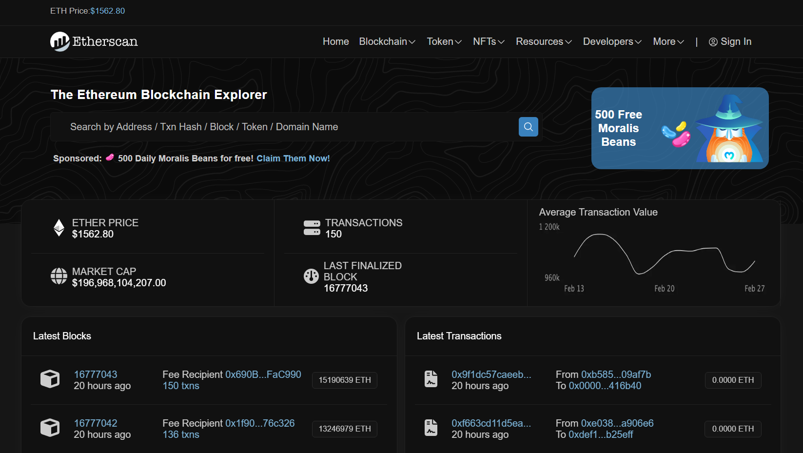
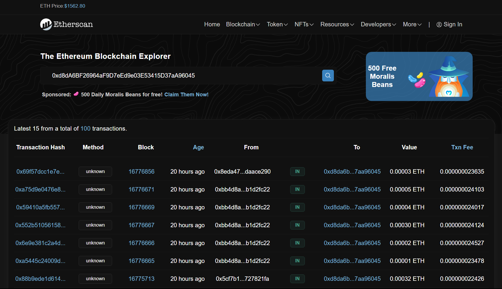

This is a [Next.js](https://nextjs.org/) project bootstrapped with [`create-next-app`](https://github.com/vercel/next.js/tree/canary/packages/create-next-app).

Its a clone of Etherscan.

## Running Project

First, add your Moralis API Key to .env file as shown in .env.example file inside backend folder.

cd into 'backend' folder then start express server:

```bash
cd backend
npm install
npm run start
```

open another terminal window and navigate to 'frontend' folder to run Next.js:

```bash
cd frontend
npm install
npm run dev
```

to build, run:

```bash
cd frontend
npm install
npm run build
```

Open [http://localhost:3000](http://localhost:3000) with your browser to see the result.

## Screenshots

### HomePagePreview



### SearchResultPreview


